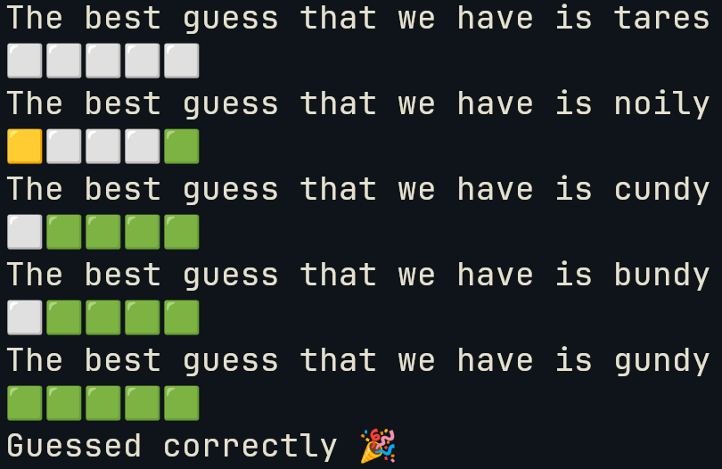
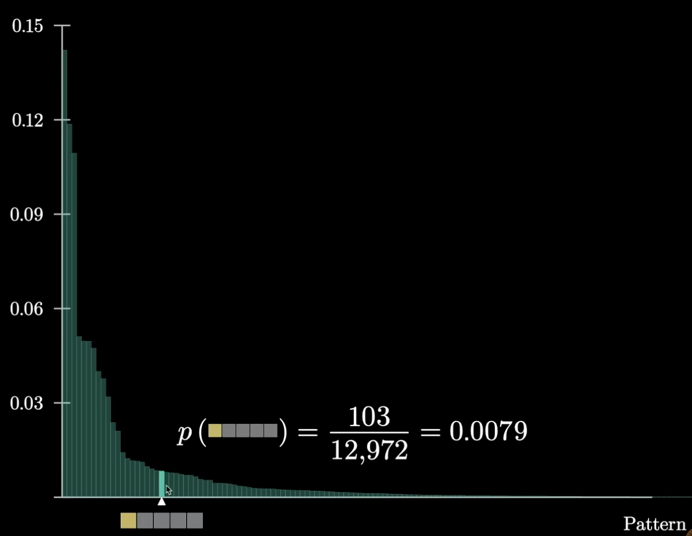
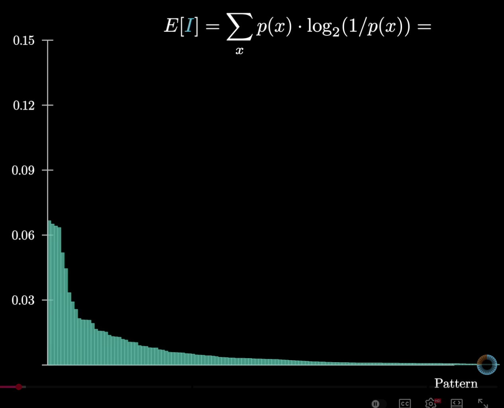

# Bruhdle

> Heavily inspired and motivated from this 3Blue1Brown video: [Solving Wordle with information theory](https://www.youtube.com/watch?v=v68zYyaEmEA&pp=ygUSM2JsdWUxYnJvd24gd29yZGxl)

Add image HERE


A simple wordle solver written using Python using information theory.

### Try it out

1. Clone the repo

```
git clone https://github.com/DogeTheBeast/bruhdle.git
cd bruhdle
```

2. Make a virtual environment and install the requirements

```
python -m venv bruhdle-venv
pip -r requirements.txt
```

3. Use either `wordle.py` to play the game or `model.py` to see it evaluate the words and play a game of wordle optimally

```
python wordle.py
python model.py
```

### How it works

**Information Theory-Based Word Selection**: The solver uses information theory to make optimal choices, maximizing the expected number of remaining possible words with each guess. For each guess, the solver looks for the word which split the possible solution space most uniformally. Borrowing visuals for the video linked above, this is the word count for each possible color feedback:



For each words, it checks against all possible wordle responses (ie, the color of the tiles) and determines the amount of words that would remain in the solution space afterwards. Using this, it assigns an expected information score to each word. The aim being to maximize the score which corresponds to the graph being flatter. This ensures that we get the most amount of information allowing us to have to search the smallest subspace of possible solutions.


